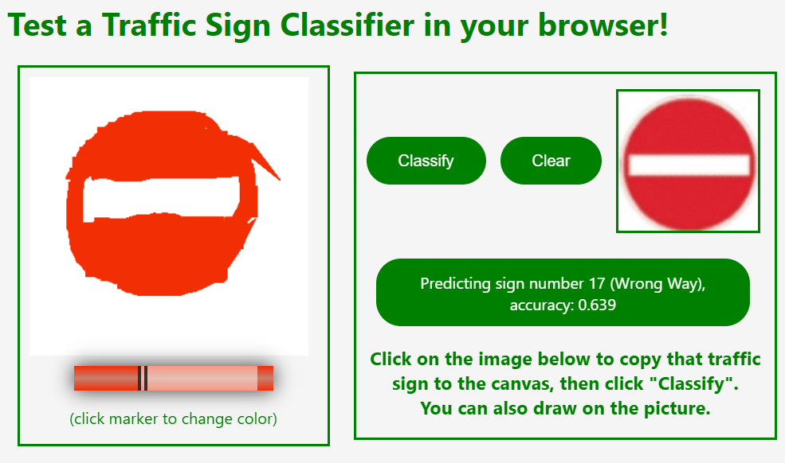

# Traffic-Sign-Classifier-in-Browser
 

A single webpage where a pre-trained traffic sign classifier model is loaded using tensorflow.js for testing its predictions with a canvas. User can choose a traffic sign to test the model, and draw on it to see how the prediction changes. Example screenshots:

 - Making a correct prediction:

 - Making an incorrect prediction:

- Drawing on top of incorrect prediction to make model do correct prediction:

- Drawing a symbol from scratch (just for fun! :)

I had previously built the traffic sign classifier model as a project for an AI course, here's a link to that: https://github.com/mszyld/CS50-AI-Python-Projects/tree/main/5.%20traffic. To convert that model to tensorflow.js I followed this guide: https://www.tensorflow.org/js/guide/conversion

Deployed at https://traffic-sign-classifier.netlify.app/
